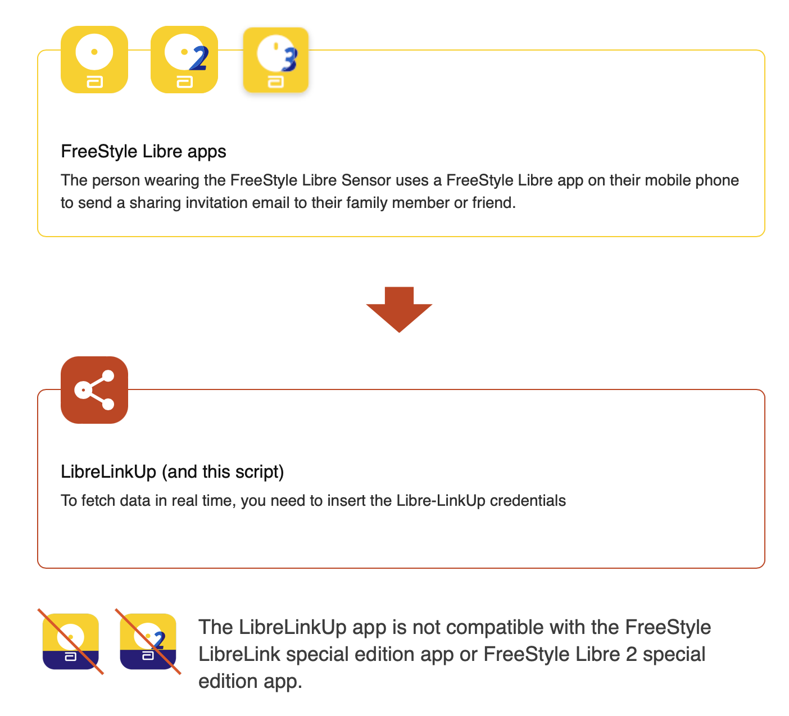

# LibreLink Up (real-time) with FHIR

This script written in TypeScript facilitates the upload of CGM (Continuous Glucose Monitoring) readings from LibreLink Up to a server that uses FHIR(Fa). It is designed to work with at least Freestyle Libre 2 (FGM) and Libre 3 CGM sensors. The original idea and initial code structure are derived from the [nightscout-librelink-up](https://github.com/timoschlueter/nightscout-librelink-up) repository within the DIY communities.

Official documentation regarding data sharing can be found at [LibreLinkUp Getting Started](https://librelinkup.com/articles/getting-started).



## Configuration

The table below lists the environment variables used in the application:

| Environment Variable    | Description                                                                                         | Example Value | Required |
|-------------------------|-----------------------------------------------------------------------------------------------------|---------------|----------|
| LINK_UP_USERNAME        | Your LibreLinkUp (LibreView) username/email address                                                   |               | Yes      |
| LINK_UP_PASSWORD        | Your LibreLinkUp (LibreView) password                                                                |               | Yes      |
| LINK_UP_CONNECTION      | Your LibreLinkUp (LibreView) Patient-ID. Can be received from the console output if multiple connections are available. |               | No       |
| LINK_UP_TIME_INTERVAL   | The time interval (in minutes) in which the values should be retrieved from LibreLinkUp              | 5             | Yes      |
| LINK_UP_REGION          | Your region. Used to determine the correct LibreLinkUp service (Possible values: US, EU, DE, FR, JP, AP, AU, AE) | EU        | No       |
| LOG_LEVEL               | The log-level to use                                                                                | info          | No       |
| SINGLE_SHOT             | Disables the scheduler and runs the script just once                                                  |               | No       |
| DEMO_ENABLED            | Enable the DEMO and runs the script just once                                                         |               | No       |
| FHIR_ID                 | FHIR ID for a patient                                                                               |               | Yes      |
| FHIR_URL                | URL of the FHIR server                                                                              |               | Yes      |
| TOKEN_ENDPOINT          | Endpoint URL for obtaining authentication tokens                                                      |               | Yes      |
| CLIENT_ID               | Client ID for authenticating with Keycloak                                                            |               | Yes      |
| CLIENT_SECRET           | Client secret for authenticating with Keycloak                                                        |               | Yes      |
| SCOPE           | Client Scope for FHIR server Keycloak                                                        |               | Yes      |

<!-- Add more details about other environment variables if applicable -->

## Usage

This script provides different options for usage.

### Variant 1: Local (Reading the file)

Run the demo script by executing the following command from the root folder after downloading the .zip file or cloning the repository.

For Linux/macOS:

```bash
# Make the script executable
chmod +x start-demo.sh

# Execute the script
./start-demo.sh
```

To execute this script in Windows:

1. Open Command Prompt (cmd).
1. Navigate to the directory where the script is saved.
1. Run the script by typing its name `start-demo.bat` and pressing Enter.

This will:

1. Initiate the process and observe the output in the console.

1. The FHIR bundle files will be available in the following folder: Demo/Data

1. Execute the script (./start-demo.sh) to initiate the process and observe the output in the console.

1. You will find the files that represent the FHIR bundle at the following folder: `Demo/Data`

### Variant 2: Local with real time data and Libre link Up

Running the Real-time Script.
**It's very important** that you replace the following vairable:

- `LINK_UP_USERNAME="your_librelinkup_username"`

- `LINK_UP_PASSWORD="your_librelinkup_password"`

To run the real-time script, follow these steps:

- Clone the repository to your local machine:

```bash
git clone https://github.com/pra008/Libre-link-up-FHIR
```

- Navigate to the project directory:

```bash
cd Libre-link-up-FHIR
```

- Run the following code, for Linux/macOS:

```bash
export DEMO_ENABLED="false"
export LOG_LEVEL="info"
export LINK_UP_USERNAME="your_librelinkup_username"
export LINK_UP_PASSWORD="your_librelinkup_password"
export LINK_UP_TIME_INTERVAL="5"
export FHIR_ID="your_fhir_id"
export FHIR_URL="your_fhir_server_url"
export TOKEN_ENDPOINT="your_token_endpoint"
export CLIENT_ID="your_client_id"
export CLIENT_SECRET="your_client_secret"
npm install
npm start dev
```

Remember to replace also `your_fhir_id`, `your_fhir_server_url`, `your_token_endpoint`, `your_client_id`, and `your_client_secret` with your actual values.

- Run the following code, for Windows:

```bash
REM Required environment variables for the demo
set "DEMO_ENABLED=false"
set "LOG_LEVEL=info"
set "LINK_UP_USERNAME=your_librelinkup_username"
set "LINK_UP_PASSWORD=your_librelinkup_password"
set "LINK_UP_TIME_INTERVAL=5"
set "FHIR_ID=your_fhir_id"
set "FHIR_URL=your_fhir_server_url"
set "TOKEN_ENDPOINT=your_token_endpoint"
set "CLIENT_ID=your_client_id"
set "CLIENT_SECRET=your_client_secret"

npm install
npm start demo

```

#### As alternative

Create a .env file in the root directory of the project.

This file will contain the required environment variables. Here's an example of the .env file:

```doetenv
LOG_LEVEL=info
DEMO_ENABLED=true
FHIR_ID=your_fhir_id
FHIR_URL=your_fhir_server_url
TOKEN_ENDPOINT=your_token_endpoint
CLIENT_ID=your_client_id
CLIENT_SECRET=your_client_secret
```

Add other variables as needed, and replace `your_fhir_id`, `your_fhir_server_url`, `your_token_endpoint`, `your_client_id`, and `your_client_secret` with your actual values.

- Run the demo script by executing the following command:

```bash
npm install
```

and then run:
```bash
npm start dev
```

This will start the demo version of the script using the configured environment variables in the .env file.

Remember to set the necessary environment variables according to your setup before running the script. You can modify the .env file with your specific values for the environment variables required by the script.